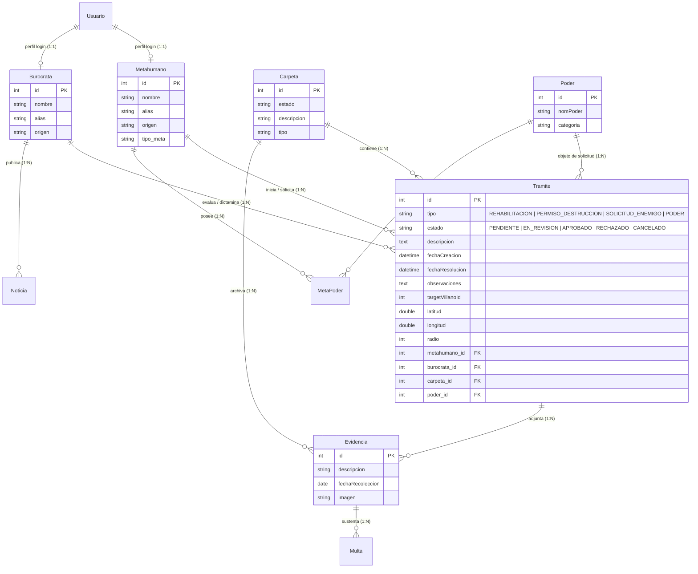

# 📑 Entidad `Tramite` — Atributos, Relaciones y Flujo

Este documento describe la especificación técnica y conceptual de la entidad **`Tramite`** dentro del sistema **SuperGestor**, explicando su propósito, catálogo de atributos, relaciones con las demás entidades del sistema, ciclo de vida y diagrama ER.

---

## 🎯 1. Propósito de la Entidad

En **SuperGestor**, los metahumanos (Héroes y Villanos) interactúan con el marco regulatorio del gobierno (Burócratas) a través de solicitudes formales. La entidad `Tramite` representa cualquier gestión administrativa iniciada por un metahumano que requiere validación, seguimiento o aprobación por parte de la burocracia estatal.

### Casos de Uso / Tipos de Trámites:
1. **🕊️ Trámite de Rehabilitación (`TRAMITE_REHABILITACION`)**:
   - Iniciado por un **Villano** para redimirse y obtener estatus de Héroe.
   - Requiere no tener multas pendientes impagas.
2. **💥 Permiso de Destrucción (`PERMISO_DESTRUCCION`)**:
   - Solicitud de un **Villano** para operar o realizar un acto dentro de una zona geográfica autorizada delimitada por coordenadas (`latitud`, `longitud`, `radio`).
3. **⚔️ Solicitud de Enemigo / Némesis (`SOLICITUD_ENEMIGO`)**:
   - Solicitud de un **Héroe** para registrar u oficializar su rivalidad con un Villano específico (`targetVillanoId`).
4. **⚡ Alta / Modificación de Poder (`SOLICITUD_PODER`)**:
   - Solicitud de un **Metahumano** para registrar una nueva habilidad sobrehumana o actualizar su nivel de dominio y control.

---

## 📋 2. Tabla Detallada de Atributos de `Tramite`

Hereda de **`BaseEntity`** (`id: number` como PK autoincremental).

| Atributo | Tipo TypeScript | Tipo SQL (MySQL) | Restricciones / Opciones | Descripción |
|---|---|---|---|---|
| `id` | `number` | `INT` | `PK`, `AUTO_INCREMENT` | Identificador único del trámite (de `BaseEntity`). |
| `tipo` | `TipoTramite` | `VARCHAR(50)` / `@Enum` | `NOT NULL` | Tipo de gestión (`REHABILITACION`, `PERMISO_DESTRUCCION`, `SOLICITUD_ENEMIGO`, `SOLICITUD_PODER`, `OTRO`). |
| `estado` | `EstadoTramite` | `VARCHAR(50)` / `@Enum` | `NOT NULL`, `default: 'PENDIENTE'` | Estado administrativo actual (`PENDIENTE`, `EN_REVISION`, `APROBADO`, `RECHAZADO`, `CANCELADO`). |
| `descripcion` | `string` | `TEXT` | `NOT NULL` | Explicación o justificación detallada de la solicitud. |
| `fechaCreacion` | `Date` | `DATETIME` | `onCreate: () => new Date()` | Fecha y hora de inicio de la solicitud. |
| `fechaResolucion`| `Date` | `DATETIME` | `NULLABLE` | Fecha en la que el burócrata aprueba o rechaza el trámite. |
| `observaciones` | `string` | `TEXT` | `NULLABLE` | Dictamen, motivos de rechazo o condiciones impuestas por el burócrata. |
| **Campos Específicos** | | | | |
| `targetVillanoId`| `number` | `INT` | `NULLABLE` | ID del villano objetivo (usado en solicitud de enemigos). |
| `latitud` | `number` | `DOUBLE` | `NULLABLE` | Coordenada geográfica de la zona solicitada. |
| `longitud` | `number` | `DOUBLE` | `NULLABLE` | Coordenada geográfica de la zona solicitada. |
| `radio` | `number` | `INT` | `NULLABLE` | Radio de alcance en metros de la zona permitida. |
| **Claves Foráneas (FK)** | | | | |
| `metahumano_id` | `number` (FK) | `INT` | `NOT NULL` | FK → `Metahumano` (solicitante del trámite). |
| `burocrata_id` | `number` (FK) | `INT` | `NULLABLE` | FK → `Burocrata` (funcionario asignado o que resolvió). |
| `carpeta_id` | `number` (FK) | `INT` | `NULLABLE` | FK → `Carpeta` (expediente administrativo contenedor). |
| `poder_id` | `number` (FK) | `INT` | `NULLABLE` | FK → `Poder` (poder involucrado si aplica). |

---

## 🔗 3. Relaciones con Otras Entidades y Cardinalidades

| Entidad Relacionada | Cardinalidad | Dirección | Descripción |
|---|:---:|:---:|---|
| **`Metahumano`** | **1 : N** | `Metahumano (1) ──── (N) Tramite` | **Un Metahumano** puede iniciar **muchos Trámites**. Cada trámite pertenece obligatoriamente a un único metahumano solicitante. |
| **`Burocrata`** | **1 : N** | `Burocrata (1) ──── (N) Tramite` | **Un Burócrata** puede revisar y dictaminar **muchos Trámites**. Un trámite puede estar sin burócrata asignado (nullable) hasta que entra en revisión. |
| **`Carpeta`** | **1 : N** | `Carpeta (1) ──── (N) Tramite` | **Una Carpeta** (expediente legal/administrativo) puede agrupar uno o varios trámites vinculados al caso. *(Opcional si el trámite vive dentro de una carpeta)*. |
| **`Poder`** | **1 : N** | `Poder (1) ──── (N) Tramite` | **Un Poder** puede ser el objeto de múltiples solicitudes de registro o ampliación. Nullable si el trámite no es de poderes. |
| **`Evidencia`** | **1 : N** | `Tramite (1) ──── (N) Evidencia` | **Un Trámite** puede requerir adjuntar una o más evidencias / certificados (documentación probatoria, fotos o peritajes). |

---

## 🔄 4. Ciclo de Vida y Transiciones de Estado

```text
       ┌──────────────┐
       │   CREACIÓN   │ (Iniciado por Metahumano)
       └──────┬───────┘
              │
              ▼
       ┌──────────────┐
       │  PENDIENTE   │ ◄─── Esperando asignación / revisión
       └──────┬───────┘
              │
              ▼ (Burócrata toma el caso)
       ┌──────────────┐
       │ EN_REVISION  │
       └──┬────────┬──┘
          │        │
 (Cumple  │        │ (Incumple requisitos / Deudas)
requisitos│        │
          ▼        ▼
 ┌─────────────┐ ┌─────────────┐
 │  APROBADO   │ │  RECHAZADO  │
 └─────────────┘ └─────────────┘
```

---

## 📊 5. Diagrama Entidad-Relación (Mermaid ER)



---

## 💻 6. Ejemplo de Entidad en TypeScript (MikroORM)

Si se desea implementar la clase en el backend (`Backend/src/tramite/tramite.entity.ts`), este es el código base recomendado:

```typescript
import { Cascade, Collection, Entity, Enum, ManyToOne, OneToMany, Property, Rel } from '@mikro-orm/core';
import { BaseEntity } from '../shared/db/baseEntity.entity.js';
import { Metahumano } from '../metahumano/metahumano.entity.js';
import { Burocrata } from '../Burocratas/Burocrata.entity.js';
import { Carpeta } from '../carpeta/carpeta.entity.js';
import { Poder } from '../poder/poder.entity.js';
import { Evidencia } from '../evidencia/evidencia.entity.js';

export enum TipoTramite {
  REHABILITACION = 'TRAMITE_REHABILITACION',
  PERMISO_DESTRUCCION = 'PERMISO_DESTRUCCION',
  SOLICITUD_ENEMIGO = 'SOLICITUD_ENEMIGO',
  SOLICITUD_PODER = 'SOLICITUD_PODER',
  OTRO = 'OTRO'
}

export enum EstadoTramite {
  PENDIENTE = 'PENDIENTE',
  EN_REVISION = 'EN_REVISION',
  APROBADO = 'APROBADO',
  RECHAZADO = 'RECHAZADO',
  CANCELADO = 'CANCELADO'
}

@Entity()
export class Tramite extends BaseEntity {

  @Enum(() => TipoTramite)
  tipo!: TipoTramite;

  @Enum({ items: () => EstadoTramite, default: EstadoTramite.PENDIENTE })
  estado: EstadoTramite = EstadoTramite.PENDIENTE;

  @Property({ type: 'text', nullable: false })
  descripcion!: string;

  @Property({ onCreate: () => new Date() })
  fechaCreacion: Date = new Date();

  @Property({ nullable: true })
  fechaResolucion?: Date;

  @Property({ type: 'text', nullable: true })
  observaciones?: string;

  // Atributos específicos según tipo
  @Property({ nullable: true })
  targetVillanoId?: number;

  @Property({ type: 'double', nullable: true })
  latitud?: number;

  @Property({ type: 'double', nullable: true })
  longitud?: number;

  @Property({ type: 'int', nullable: true })
  radio?: number;

  // Relaciones
  @ManyToOne(() => Metahumano, { nullable: false })
  metahumano!: Rel<Metahumano>;

  @ManyToOne(() => Burocrata, { nullable: true })
  burocrata?: Rel<Burocrata> | null;

  @ManyToOne(() => Carpeta, { nullable: true })
  carpeta?: Rel<Carpeta> | null;

  @ManyToOne(() => Poder, { nullable: true })
  poder?: Rel<Poder> | null;

  @OneToMany(() => Evidencia, evidencia => evidencia.tramite, {
    cascade: [Cascade.ALL],
    nullable: true
  })
  evidencias = new Collection<Evidencia>(this);
}
```
